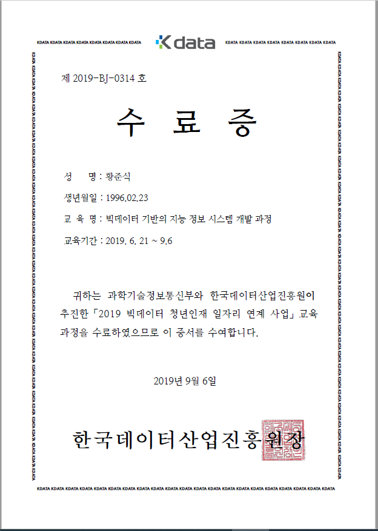
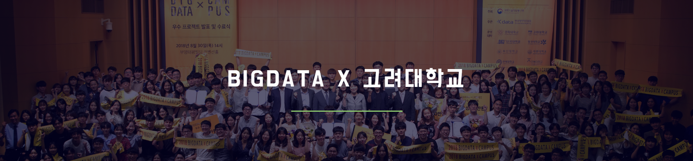
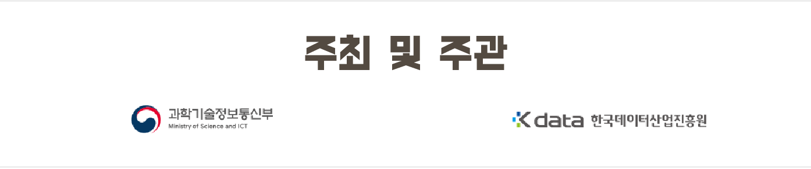
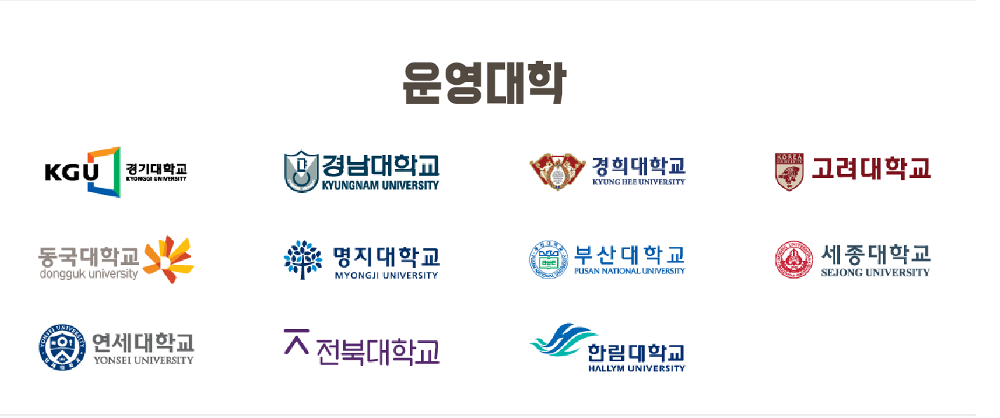
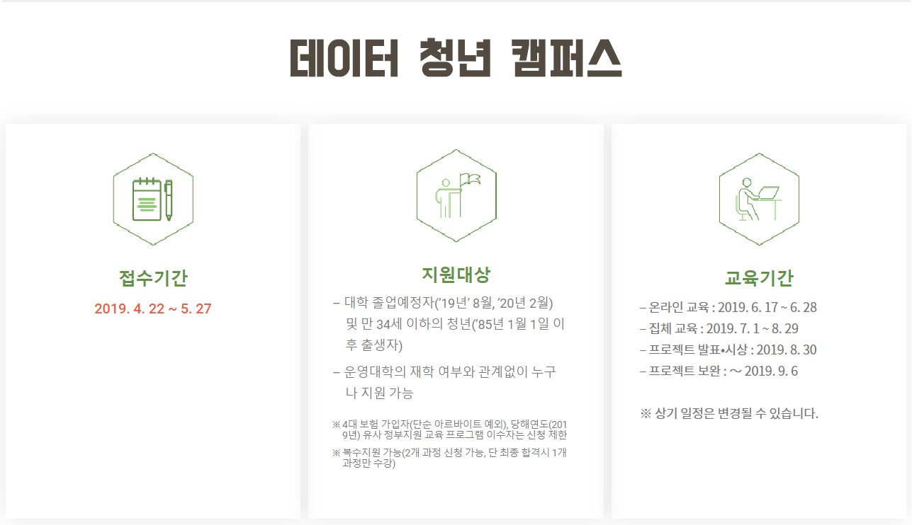

# 고려대학교 빅데이터 과정(2019)

## 상세 커리큘럼

- Python 고급 : Debug, Testing 기법 / 함수형 기법 / 객체지향 기법 / 디자인 패턴 / 오픈소스, 형상관리(35H)

- 데이터 수집/전처리(정형데이터) : 다양한 데이터 수집 방법 / 정형 데이터 관리 및 전처리 (SQL, ORM, XML, Json)(35H)

- 데이터 수집/전처리(비정형데이터) : 비정형 데이터 수집 / 관리 및 전처리 (NoSQL, ElasticSeach)(35H)

- 기초 통계 분석 / 기계학습 : Pandas를 활용한 기초 통계 분석/EDA, Scikit-learn/statsmodel을 활용한 기계학습 기반의 분석(35H)

- 자연어처리/딥러닝 : 다양한 자연어 처리 / 딥러닝 기법을 통한 데이터 분석(35H)

- 프로젝트 개발 : 팀 프로젝트(90H)